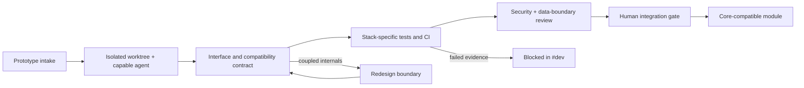

# SAI development roadmap — CTO operating view

The machine-readable source is `roadmap.json`. Changes require a reviewed
commit; state transitions and blockers are summarized in Slack `#dev`
(`C0BHBGBNMT7`). This initial roadmap avoids inventing a technology stack—the
repository does not yet contain application code or an accepted stack decision.

## Active lanes

| Lane | Initial status | Next decision |
|---|---|---|
| Core architecture | proposed | Choose the stack through a reviewed decision record |
| Prototype environments | proposed | Define prototype intake and compatibility manifests |
| Agent runtime integrity | active | Audit runtime-specific capability evidence |
| Development CI | active | Add stack checks when the stack exists |
| Semantic tracking | proposed | Define a module/interface inventory schema |

## Operating rules

1. Parallel work begins only after a unique branch, isolated worktree, agent
   owner, and claimed files are recorded.
2. A prototype declares its public interfaces and compatibility assumptions
   before core integration work.
3. CI grows with the chosen stack; audit, semantic hierarchy, and handoff checks
   remain mandatory baselines.
4. `#agentupdates` is the audit feed; `#dev` is the development coordination and
   roadmap feed.
5. Architecture, migrations, releases, and shared-resource deletion stop at the
   applicable human review gate.
